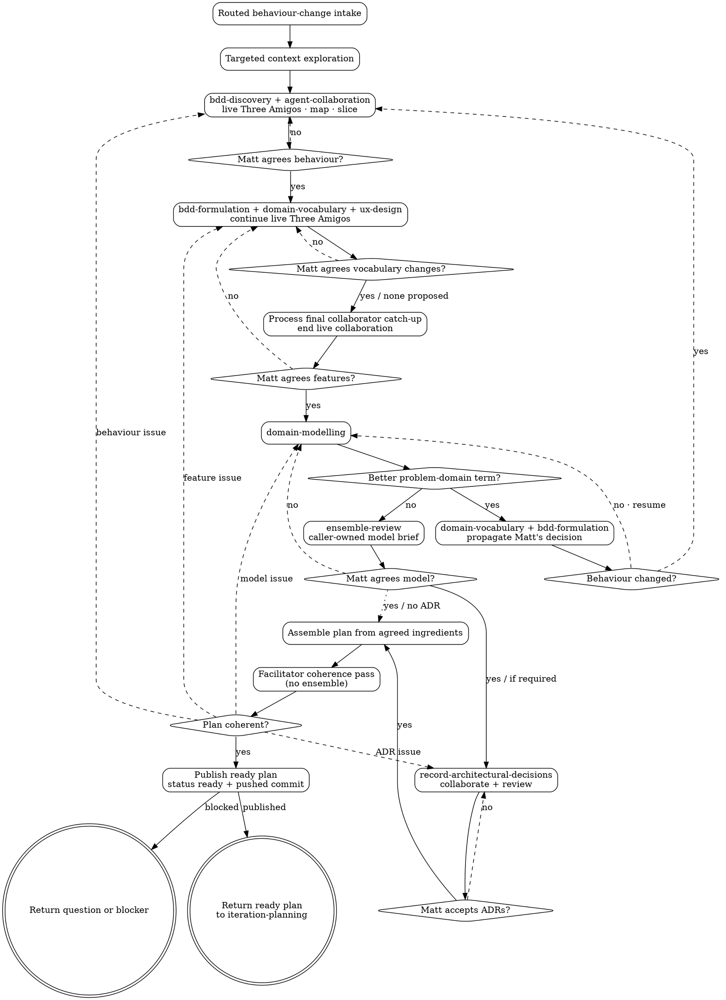

# Behaviour-Changing Iteration Planning

## Overview

Starting from the intake supplied by `iteration-planning`, turn an intended behaviour change into a published ready implementation plan. Challenge and agree behaviour before modelling it; agree the model before recording consequential ADRs.

<HARD-GATE>
Do NOT implement the iteration directly in the local checkout. Do NOT edit application code, migrations, step definitions, or UI. Planning may edit only iteration-planning artifacts in that iteration's `docs/iterations/` folder, acceptance feature files/scenarios that are part of planning, `docs/problem-domain-terms.md` for vocabulary changes Matt explicitly agrees, and ADRs plus `docs/adr/README.md` that record architecture decisions Matt explicitly made during the modelling session. Feature files and the agreed ADRs are seeds for implementation; step definitions and executable test plumbing are implementation. Never create or accept a consequential ADR autonomously. This skill's terminal state is a committed, pushed and ready behaviour plan; an optionally validated plan when Matt explicitly chose validation-only; a question returned to Matt; or a clear planning, publication or optional-validation blocker. Fabro validation-and-launch belongs to `iteration-delivery`.
</HARD-GATE>

## Checklist

Create a task for each item and complete them in order.

1. **Explore targeted context** — now that intake has identified the behaviour, inspect only the relevant existing behaviour, code, plans, accepted ADRs, problem notes and designs.
2. **Clarify intake** — ask Matt one question at a time only where the routed problem, outcome, beneficiary or boundary remains unclear.
3. **Example map with live Three Amigos** — use `bdd-discovery` and `agent-collaboration` to map rules, examples, questions and deferred stories while Product/business, Development, and Testing collaborators follow the facilitator conversation. Integrate significant questions and counterexamples while discovery is happening. Aggressively look for holes and unnecessary rules; split or defer scope before choosing architecture.
4. **Agree the map** — process the collaborators' discovery catch-up, then present the remaining significant alternatives and questions to Matt. Revise through `bdd-discovery` until Matt agrees the behaviour and deferrals; do not launch a post-hoc map review.
5. **Formulate features, names, and UX** — continue the same Three Amigos collaboration through `bdd-formulation`; use `domain-vocabulary` for shared problem-domain names and invoke `ux-design` for visible surfaces. Integrate significant observations as scenarios become concrete. Matt explicitly agrees any lexicon addition, replacement, changed meaning, and material UX decision. If `ux-design` returns a blocking environment handoff, stop before drafting or publishing the plan.
6. **Agree features** — process the collaborators' final formulation catch-up, end the live collaboration, and return policy gaps to discovery, formulation defects to `bdd-formulation`, naming issues to `domain-vocabulary`, and design issues to `ux-design`. Matt agrees the scenarios, vocabulary, and design coverage before modelling; do not run a separate post-hoc feature review.
7. **Model the domain** — use `domain-modelling` in the current conversation. If modelling exposes an unnecessary or unclear rule, return to example mapping. If commands, events, or invariants reveal a more natural problem-domain noun or verb, use `domain-vocabulary` to ask Matt, then apply his decision consistently to the lexicon, scenarios, and model through `bdd-formulation`. Check that rules, examples, timing, actors, and outcomes are unchanged; do not add another approval ceremony merely to propagate the agreed term. If the change would alter behaviour, return to discovery and formulation.
8. **Review and agree the model** — run `ensemble-review` with the Domain-model brief below. Resolve findings through `domain-modelling` and vocabulary findings through the formulation loop, then obtain Matt's agreement.
9. **Resolve architecture decisions** — use `record-architectural-decisions` for consequential choices emerging from the agreed model. That shared skill owns ADR collaboration, its caller-supplied ensemble brief, publication, and Matt's explicit acceptance.
10. **Assemble the plan** — compose the agreed features, vocabulary, design, domain model, ADRs, scope/deferrals and validation approach without introducing new decisions.
11. **Facilitator coherence pass** — as the planning facilitator, check the assembled plan against the agreed ingredients, implementation boundary, validation approach, and status/index metadata. Do not run a duplicate assembled-plan ensemble. Return substantive issues to the owning skill and repeat that ingredient's existing review and Matt-agreement checkpoint. No separate plan-approval ceremony is required.
12. **Publish the ready plan** — write the iteration artifacts and indexes with status `ready`, run targeted planning checks, then commit and push. If Matt explicitly chooses validation-only before launch, run `bin/dev fabro validate-plan <plan_path>` after publication and route substantive findings back through their owning skill and checkpoint.
13. **Return the result** — give `iteration-planning` the ready plan path and pushed commit, or the validated result when validation-only was explicitly chosen, or the exact question/blocker. Do not run `bin/dev fabro deliver`.

## Domain-Model Ensemble Brief

The brief also includes:

- **Known questions:** the artifact's current open questions, or `None`.
- **Constraints:** the agreed outcome, boundaries and non-goals; read-only review; no product-policy, architecture, vocabulary or acceptance decisions; Matt is decision owner.

### Domain-model brief

- **Subject/artifact:** agreed scenarios/vocabulary, draft domain model, current constraints and deferrals.
- **Focus:** (1) simplicity and accidental complexity, (2) invariants/lifecycle/temporal counterexamples, (3) language, ownership and traceability.
- **Rubric:** Does the model implement only agreed behaviour? Are lifecycle, commands, events, invariants, authorization and responsibility boundaries coherent? Does it reuse canonical problem-domain language while separating solution terms? Which consequential choices need Matt and perhaps an ADR?
- **Feedback route:** `domain-modelling`; naming conflicts through `bdd-formulation` plus `domain-vocabulary`; policy issues through `bdd-discovery`; decisions to Matt.

## Process Flow



A changed model or ADR must repeat its existing ensemble and Matt-agreement/acceptance checkpoint. Reopened discovery or formulation uses a bounded collaboration catch-up when useful; it does not automatically recreate a post-hoc review panel.

## BDD Scenario Heuristics

Do not treat BDD as optional polish for behaviour-facing work. Make an explicit BDD decision during planning and write it into `## Acceptance Scenarios / Feature Files`.

Default to drafting or updating Gherkin when any of these are true:

- The iteration changes who can do what, when, or under which policy.
- The behaviour is visible to a customer, member, club operator, staff user, or support/operator persona.
- The plan contains business rules, permissions, lifecycle states, eligibility, routing, notification, pricing, privacy, or safety/trust implications.
- The examples would help Matt spot a misunderstanding before implementation.
- The behaviour needs edge-case examples to explain it clearly, such as unknown/expired/duplicate/unauthorised/error cases.
- Future agents or collaborators would benefit from stakeholder-readable executable documentation.

Use `bdd-discovery` before writing Gherkin when the rules, examples, vocabulary, questions, or slice boundaries are not yet obvious. Signals include multiple actors, several rules in one idea, policy exceptions, uncertainty about expected outcomes, or examples that reveal the iteration may need slicing.

Use `bdd-formulation` when drafting or reviewing Gherkin scenarios so feature files remain domain modelling artifacts rather than test scripts.

When deciding not to add or change feature files for a behaviour-facing iteration, write a short rationale in the plan. A good rationale names the existing scenario that already covers the rule, or explains why the behaviour is too internal/obvious for a useful stakeholder example. `Covered by ExUnit/controller tests` is not sufficient by itself for business-facing behaviour.

## Interview Guidance

Ask only one question per message. Prefer multiple choice when it lowers effort, but use open questions when needed. When asking a multiple-choice question, use the `question` tool rather than writing A/B/C/D options in prose. Use normal chat only for open-ended questions or when the tool cannot express the choice clearly.

Before or during early brainstorming, inspect `docs/problems/README.md` and relevant `docs/problems/*.md` files. Use them to ask whether the iteration should resolve, partially address, or deliberately defer any captured problems. If Matt's idea resembles an unresolved or partially addressed problem, name that problem explicitly and ask how tightly the iteration should target it.

Cover these topics:

- **Goal** — what should be true after the iteration that is not true now?
- **Related problems** — which `docs/problems` notes does this iteration address, partially address, depend on, or leave unresolved?
- **Beneficiary** — who benefits: club admin, member, developer/operator, or another actor?
- **Smallest useful slice** — is this one rule or one piece of engineering, or several? (see Sizing and Slicing)
- **Scope boundaries** — what is explicitly out of scope?
- **Acceptance criteria** — concrete behaviours, examples, edge cases, permissions, and error states.
- **Business decisions** — domain, policy, copy, workflow, pricing, privacy, or support questions.
- **Technical shape** — likely modules, data, events/commands, integrations, UI, background work, and migration concerns.
- **UX design** — does this iteration alter a visible surface, state, interaction, content journey, or email? If so, invoke `ux-design` and use its design record.
- **Validation** — automated tests, acceptance tests, shared Cucumber scenarios, manual demo, stakeholder review, or operational checks.

Intake clarification stops when there is enough shared context to begin example mapping. Discovery and modelling continue until the plan can be written without an implementor inventing material product, domain-model or architecture decisions.

## Sizing and Slicing

An iteration should be **one shippable slice**: either one behaviour rule, or
one piece of engineering. Before drafting the plan, check the size and split
if needed.

- **Find the seams.** For behaviour-facing work, each Rule from example
  mapping is normally its own shippable slice, with that rule's examples as
  the slice's acceptance scenarios.
- **Foundation first.** When behaviour needs architecture that does not exist
  yet (e.g. an event store before the first message can be sent), make that
  enabling architecture its own earlier technical iteration.
- **Split when it is more than one slice.** If the work spans several rules or
  bundles new architecture with behaviour, write it as several iteration
  plans, each independently shippable, rather than one big plan. A good slice
  leaves the build green with strictly more scenarios passing — while preserving a safe, coherent product state.

If you split a plan, replace it with the child plans (no parent/epic doc) and
number them sequentially before any of them is implemented.

Worked example: the original "member message deliverability" plan bundled the
whole event-sourced stack, two contexts, and all delivery statuses into 18
tasks, and repeatedly failed to implement. It was split into four shippable
iterations — `001` event-sourced foundation (technical), then `002`
membership, `003` messaging, `004` statuses and views (one rule each). See
`docs/iterations/`.

## Plan Format

Write the plan as Markdown with these sections:

```markdown
# <Iteration title>

Date: YYYY-MM-DD
Status: draft | ready | needs-revision

## Goal

## Background / Context

## Related Problems

List relevant `docs/problems` notes. For each one, state whether this iteration is expected to resolve it, partially address it, depend on it, or leave it unresolved. If none are relevant, write `None known.`

## Scope

### In scope

### Out of scope

## Iteration Type

Behaviour-facing. Identify the user-observable rule or policy changed.

## Acceptance Scenarios / Feature Files

State the BDD decision: `Required`, `Useful but not required`, or `Not useful for this slice`. For behaviour-facing iterations, name the shared Cucumber feature file(s) and scenarios that will express the business rules, or state why Gherkin would not add useful stakeholder-readable examples for this slice. If implementation is allowed to edit `.feature` files, also include a separate `## Allowed acceptance feature changes` section naming each exact file, the allowed kind of change, the reason, and how coverage is preserved or intentionally changed.

## Designs

Use the `ux-design` output. List each affected surface and state with exact design paths, agreed decisions, slice omissions, accessibility/responsive considerations, and any required handoff or fast-follow. Write `No design needed` with the skill's reason only when nothing visible changes.

## Acceptance Criteria

## Open Business Decisions

## Domain Vocabulary

List canonical terms reused, Matt-agreed additions/changes recorded in `docs/problem-domain-terms.md`, deliberately separate solution-domain terms, and unresolved naming questions.

## Domain Model

Document the agreed concepts and vocabulary, lifecycle/state changes, invariants, commands, events, actors, aggregate/context ownership, responsibility boundaries, important temporal examples, changes from the current model, and deliberately deferred modelling questions.

## Architecture Decisions

Link the accepted ADRs produced or confirmed during planning. State `None required` when the agreed model introduces no consequential architecture decision. Never use this section to defer an ADR decision to implementation.

## Implementation Plan

## Open Technical Decisions

## New Capability

What we expect to be able to do once this is done that we could not do before.

## Validation Plan

How we will validate that we have been successful.

## Risks / Follow-ups
```

Keep plans focused. If a section has no open decisions, write `None known.` rather than omitting it.

## Writing the Plan

- Create `docs/iterations/` if it does not exist.
- Maintain `docs/iterations/README.md` as the iteration index.
- Read `docs/problems/README.md` if it exists, plus any relevant `docs/problems/*.md` notes. If the directory exists but no README exists, inspect the problem files directly.
- Include a `## Related Problems` section in the plan. Link each relevant problem note and say whether the iteration should resolve it, partially address it, depend on it, or intentionally leave it unresolved. If there are no relevant captured problems, write `None known.`
- Include `## Domain Vocabulary`, `## Domain Model`, and `## Architecture Decisions`. Vocabulary changes must be agreed by Matt and recorded in `docs/problem-domain-terms.md`; the model records decisions agreed during modelling and is not a placeholder for the implementor. Link every required accepted ADR, and do not mark a consequential architecture decision resolved unless Matt participated in and accepted it through `record-architectural-decisions`.
- Create one folder per iteration using the next sequential zero-padded iteration number and a lowercase hyphenated topic slug.
- Determine the next number by inspecting existing `docs/iterations/NNN-*` folders; start at `001` if none exist.
- Save the plan as `plan.md` inside that folder.
- Put supporting planning artifacts for the same iteration in the same folder, such as `manual-demo-script.md` or `validation-notes.md`.
- Classify the iteration as behaviour-facing and fill in `## Acceptance Scenarios / Feature Files` with a BDD decision of `Required`, `Useful but not required`, or `Not useful for this slice`, plus either the feature file(s)/scenario summaries that express the business rules or an explicit rationale for why Gherkin would not add useful stakeholder-readable examples. Do not rely on low-level ExUnit/controller tests as a substitute for this BDD decision.
- Apply the BDD scenario heuristics above before deciding. If two or more “default to Gherkin” signals apply, draft scenarios unless Matt explicitly decides otherwise.
- Draft or update shared Cucumber feature files/scenarios when they clarify the iteration's domain behaviour. Use `bdd-discovery` first if the rules/examples are unclear, and `bdd-formulation` when writing or reviewing the Gherkin. Keep scenarios abstract from test infrastructure: no CSS selectors, route names, button-click choreography, database setup, or adapter configuration.
- Include the `## Designs` record returned by `ux-design`. Do not duplicate or weaken that skill's source, environment, handoff, review, or Matt-decision boundaries.
- Tag every scenario created or changed during planning with the iteration tag `@iteration-NNN`, where `NNN` is the zero-padded iteration number. If every scenario in a new or changed feature belongs to that iteration, a feature-level `@iteration-NNN` tag is acceptable. Do not remove older iteration tags from existing scenarios; multiple iteration tags are allowed and useful when a scenario evolves across iterations.
- Preserve a green mainline while planning. Existing executable scenarios should keep passing. If planning deliberately rewrites or adds scenarios that describe future behaviour and would fail before implementation catches up, tag each affected scenario with the project’s runner-debt tags: `@todo-domain` when domain support is pending, and `@todo-ui` when browser support is pending. If every scenario in a changed feature has the same pending runner support, feature-level tags are acceptable. Prefer scenario-level tags when only part of a feature is unfinished. Do not leave untagged future-facing scenarios that make `dev check` fail.
- When feature files/scenarios are created or changed, show Matt the feature file path, which scenarios are tagged with `@iteration-NNN`, which have `@todo-domain` and/or `@todo-ui`, and a concise summary of the scenarios. Explicitly ask him to review the language/examples before treating the plan as final.
- Before publishing, run `dev check` whenever acceptance feature files changed, as required by project guidance. For docs-only planning with no acceptance changes, review the artifacts for coherence, run `git diff --check`, and do not run `dev check`. If the full check fails because a future-facing scenario is unimplemented, add or narrow the relevant `@todo-domain` and/or `@todo-ui` tags rather than editing step definitions or app code. If the project does not configure those tags to exclude the pending scenario from the relevant runner, stop and report that the planning change would make the build red instead of committing it.
- Do not implement step definitions, fixtures, app code, migrations, UI, or test adapters during planning.
- Add or update the index entry in `docs/iterations/README.md` with the iteration number, title/topic, plan link, date, status `ready`, and any acceptance feature files changed.
- Do not update Fabro workflow code or problem-note status files during ordinary iteration planning. The relevant problems belong in the plan's `## Related Problems` section. Only edit `docs/problems/*.md` or `docs/problems/README.md` if Matt explicitly asks for problem-note maintenance as part of the planning task.
- Example: `docs/iterations/001-member-import/plan.md`.
- Commit and push the ready plan, iteration index, supporting planning artifacts, acceptance feature files, Matt-agreed `docs/problem-domain-terms.md` changes, ADRs explicitly accepted by Matt, and `docs/adr/README.md` so Fabro can see the exact published state. Do this only after the acceptance files are either still executable and green, or carry the relevant `@todo-domain` and/or `@todo-ui` tags and are excluded from the planning-time checks. Return the ready plan unless Matt explicitly chooses validation-only before launch.
- Include workflow/skill changes in that commit only when they are needed for planning.
- Do not commit or push unrelated changes or implementation work.

## Optional Validation-Only

Published `ready` is the normal planning handoff. If Matt explicitly wants validation without implementation, run:

```bash
bin/dev fabro validate-plan docs/iterations/NNN-topic/plan.md
```

If validation reports `NOT READY`, preserve the Fabro feedback and return each substantive issue to its owning skill. Repeat that ingredient's existing collaboration or ensemble and Matt-agreement/acceptance checkpoint as applicable, update and publish the affected planning artifacts, and rerun validation only if Matt still wants validation-only. Validation must not invent product or architecture decisions.

When complete, return the plan path, pushed commit, validation result, related problems, changed feature files/tags, accepted ADRs, and any unresolved blocker to `iteration-planning`. Do not run `bin/dev fabro deliver`; `iteration-delivery` owns validation-and-implementation launch.

## Key Principles

- One question at a time.
- Example-map and defer before modelling; agree formulated features and vocabulary before modelling; model before invoking `record-architectural-decisions`; accept ADRs before implementation.
- Compose planning from the `bdd-discovery`, `bdd-formulation`, `agent-collaboration`, `domain-vocabulary`, `ux-design`, `domain-modelling`, `record-architectural-decisions`, and `ensemble-review` skills rather than duplicating their specialist procedures.
- Live Three Amigos collaborators challenge discovery and formulation while understanding is still changing. Ensemble reviewers remain available for bounded domain-model, UX, and ADR artifacts. Matt agrees behaviour, formulated features, domain models and ADRs. The facilitator coherence pass is not a duplicate assembled-plan ensemble, and the assembled plan needs no separate approval ceremony.
- One iteration is one slice: one rule, or one piece of engineering. Split anything bigger.
- Make business decisions explicit.
- Document the agreed domain model systematically rather than leaving commands, events, invariants or ownership for implementation to invent.
- Make technical decisions explicit enough to start.
- Make acceptance criteria testable.
- Make validation observable.
- If a person sees it, invoke `ux-design` and carry its agreed design record into the plan.
- Do not implement or launch delivery in this skill; return the published ready plan, or an explicitly validation-only result, to `iteration-planning`.
