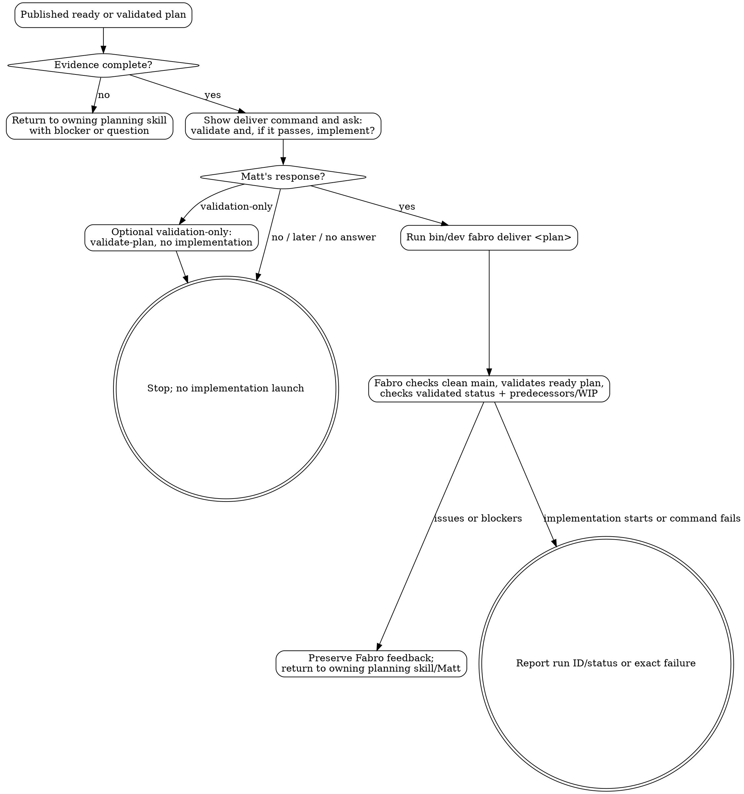

# Iteration Delivery Launch

This skill owns the boundary between planning and implementation. It does not plan, revise, or implement locally. It uses the existing Fabro delivery command only after Matt gives one explicit approval for this plan.

## Required Input

Require:

- exact `docs/iterations/NNN-topic/plan.md` path;
- pushed commit containing the planning artifacts;
- plan/index status `ready` or evidence that the same published plan is already `validated`;
- any known delivery blocker or active WIP status.

If the plan is not published as `ready` or `validated`, return to the appropriate planning skill. Do not repair it here.

## Ask Before Delivery

Show Matt the exact command:

```bash
bin/dev fabro deliver docs/iterations/NNN-topic/plan.md
```

Ask: **“Do you want me to validate this plan and, if it passes, implement it with this command?”**

Planning completion, publication, validation-only success, feature agreement, domain-model agreement, or ADR acceptance is not launch approval.

- If Matt says yes explicitly, run the command and report the initial run ID/status or exact failure. `bin/dev fabro deliver` owns the clean-main check, validation for `ready` plans, validated-status check, predecessor/WIP controls, and implementation launch.
- If the plan is already `validated`, still require explicit approval before running `bin/dev fabro deliver`; do not infer approval from the earlier validation.
- If Matt chooses validation-only, do not run `bin/dev fabro deliver`. Use or hand off `bin/dev fabro validate-plan docs/iterations/NNN-topic/plan.md` only for that validation-only request.
- If Matt says no, later, validation-only, or does not answer, stop without launching implementation.

## Launch Boundaries

- Do not edit planning artifacts, product code, workflow files or tests.
- Do not start a different plan or bypass iteration ordering/WIP controls.
- Do not retry, rescue, push, merge, remove or resume a run unless Matt separately authorizes that action.
- Never use `fabro rm` without Matt's explicit approval as a last resort.
- If Fabro returns validation issues, delivery questions, predecessor/WIP blockers, or any other failure before implementation starts, preserve the exact feedback and return it to the owning planning skill or Matt. Do not autonomously make consequential changes or auto-retry.
- If Fabro is unavailable or fails before creating a run, report the exact error and the same safe retry command; do not call the iteration delivered.

## Process Flow


