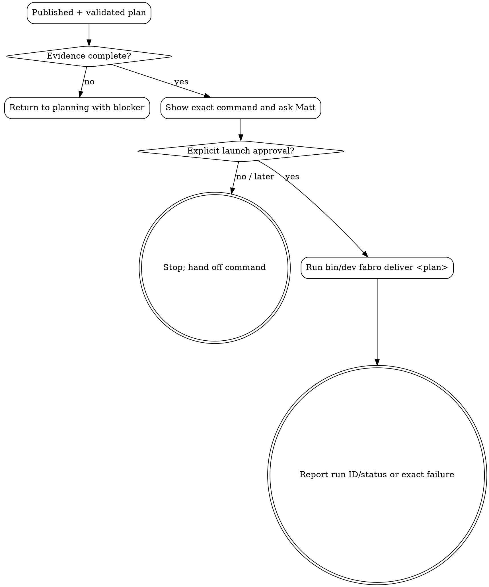

# Iteration Delivery Launch

This skill owns the boundary between planning and implementation. It does not plan, revise, validate or implement an iteration.

## Required Input

Require:

- exact `docs/iterations/NNN-topic/plan.md` path;
- pushed commit containing the planning artifacts;
- successful plan-validation result for that published state;
- any relevant delivery blocker or active WIP status.

If the plan is not published and validated, return to the appropriate planning skill. Do not repair it here.

## Ask Before Launch

Show Matt the exact command:

```bash
bin/dev fabro deliver docs/iterations/NNN-topic/plan.md
```

Ask whether he wants this session to run it now or stop after handing off the command. Planning completion is not launch approval.

- If Matt says yes explicitly, run the command and report the initial run ID/status or exact failure.
- If Matt says no, later, or does not answer, stop without running it.
- Do not infer approval from plan, feature, domain-model or ADR agreement.

## Launch Boundaries

- Do not edit planning artifacts, product code, workflow files or tests.
- Do not start a different plan or bypass iteration ordering/WIP controls.
- Do not retry, rescue, push, merge, remove or resume a run unless Matt separately authorizes that action.
- Never use `fabro rm` without Matt's explicit approval as a last resort.
- If Fabro is unavailable or fails before creating a run, report the exact error and the same safe retry command; do not call the iteration delivered.

## Process Flow


