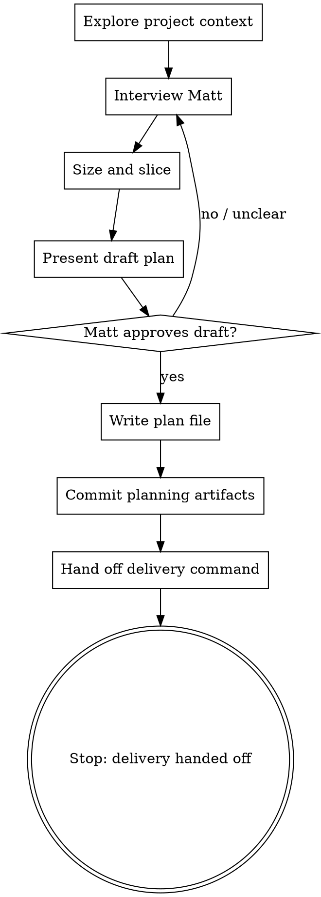

# Iteration Planning Interview

## Overview

Help Matt turn an early idea for the next iteration into an implementation-ready iteration plan. Interview him through natural collaborative dialogue, write the plan down, publish it, and tell Matt how to launch the user-controlled Fabro delivery command.

<HARD-GATE>
Do NOT implement the iteration directly in the local checkout. Do NOT edit application code, migrations, step definitions, UI, or production docs except for iteration-planning artifacts in that iteration's `docs/iterations/` folder and acceptance feature files/scenarios when they are part of planning. Feature files are domain modelling and acceptance criteria; step definitions and executable test plumbing are implementation. This skill's terminal state is either committed and pushed planning artifacts with the exact `bin/dev fabro deliver <plan_path>` command for Matt to run, a revised plan after optional validation feedback, or a clear explanation of why publishing was blocked.
</HARD-GATE>

## Checklist

Create a task for each item and complete them in order:

1. **Explore project context** — read relevant project docs, current plans, ADRs, recent commits, and code only as needed to understand the iteration.
2. **Interview Matt** — ask clarifying questions one at a time about goal, scope, acceptance criteria, business decisions, implementation shape, and validation.
3. **Size and slice** — decide whether the work is one shippable slice or several. If it is more than one, split it into separate iteration plans before going further (see Sizing and Slicing).
4. **Present draft plan sections and feature scenarios** — get Matt's approval or corrections before writing the final plan. For every behaviour-facing iteration, present the BDD decision explicitly: either the acceptance feature files/scenarios to draft or update, or the reason Gherkin would not add useful stakeholder-readable examples for this slice. If acceptance feature files/scenarios are drafted or changed, explicitly invite Matt to review them as domain language before calling the plan done.
5. **Write the iteration plan** — create an iteration folder at `docs/iterations/<iteration-number>-<topic>/` and save the plan as `plan.md` inside it. Add supporting planning artifacts there too, such as a manual demo/test script when useful. Include an `Iteration Type` section and an `Acceptance Scenarios / Feature Files` section. Draft or update acceptance feature files/scenarios when they clarify the domain behaviour for the iteration; for behaviour-facing iterations, do not leave this section silent. If no Gherkin changes are useful, state the rationale. If feature changes are intentionally ahead of implementation and may fail today, mark the affected new/changed scenarios (or the whole feature) with `@wip` before publishing them. Maintain `docs/iterations/README.md` as an index.
6. **Publish planning artifacts** — before committing, verify the checkout is not left red by planning-only acceptance changes; run `dev check` when practical, or at least the targeted test/configuration checks that would discover the changed feature files. If a planning feature is expected to fail until implementation, confirm it is tagged `@wip` and excluded by the relevant test command/configuration. Then commit and push the plan, iteration index, supporting planning artifacts, acceptance feature files, and any workflow/skill changes needed for validation before running Fabro, so Fabro's clone-based remote sandbox can see them. Do not commit or push unrelated changes.
7. **Hand off delivery** — do not launch delivery automatically. Report the exact command Matt should run:
   ```bash
   bin/dev fabro deliver <plan_path>
   ```
   If Matt explicitly asks for early plan validation before delivery, run `bin/dev fabro validate-plan <plan_path>` and use its feedback to revise the plan if needed.

## Process Flow



## BDD Scenario Heuristics

Do not treat BDD as optional polish for behaviour-facing work. Make an explicit BDD decision during planning and write it into `## Acceptance Scenarios / Feature Files`.

Default to drafting or updating Gherkin when any of these are true:

- The iteration changes who can do what, when, or under which policy.
- The behaviour is visible to a customer, member, club operator, staff user, or support/operator persona.
- The plan contains business rules, permissions, lifecycle states, eligibility, routing, notification, pricing, privacy, or safety/trust implications.
- The examples would help Matt spot a misunderstanding before implementation.
- The behaviour needs edge-case examples to explain it clearly, such as unknown/expired/duplicate/unauthorised/error cases.
- Future agents or collaborators would benefit from stakeholder-readable executable documentation.

Use `bdd-discovery` before writing Gherkin when the rules, examples, vocabulary, questions, or slice boundaries are not yet obvious. Signals include multiple actors, several rules in one idea, policy exceptions, uncertainty about expected outcomes, or examples that reveal the iteration may need slicing.

Use `bdd-formulation` when drafting or reviewing Gherkin scenarios so feature files remain domain modelling artifacts rather than test scripts.

It is usually reasonable not to add Gherkin when the iteration is purely technical or operational and has no new user-observable rule: refactoring, dependency updates, internal performance work, logging/observability, CI/tooling, bug fixes where an existing scenario already states the intended behaviour, or implementation plumbing for a previously formulated scenario.

When deciding not to add or change feature files for a behaviour-facing iteration, write a short rationale in the plan. A good rationale names the existing scenario that already covers the rule, or explains why the behaviour is too internal/obvious for a useful stakeholder example. `Covered by ExUnit/controller tests` is not sufficient by itself for business-facing behaviour.

## Interview Guidance

Ask only one question per message. Prefer multiple choice when it lowers effort, but use open questions when needed.

Cover these topics:

- **Goal** — what should be true after the iteration that is not true now?
- **Beneficiary** — who benefits: club admin, member, developer/operator, or another actor?
- **Smallest useful slice** — is this one rule or one piece of engineering, or several? (see Sizing and Slicing)
- **Scope boundaries** — what is explicitly out of scope?
- **Acceptance criteria** — concrete behaviours, examples, edge cases, permissions, and error states.
- **Business decisions** — domain, policy, copy, workflow, pricing, privacy, or support questions.
- **Technical shape** — likely modules, data, events/commands, integrations, UI, background work, and migration concerns.
- **Validation** — automated tests, acceptance tests, shared Cucumber scenarios, manual demo, stakeholder review, or operational checks.

Stop interviewing when you can write a plan that an engineer could start without inventing material product or technical decisions.

## Sizing and Slicing

An iteration should be **one shippable slice**: either one behaviour rule, or
one piece of engineering. Before drafting the plan, check the size and split
if needed.

- **Classify the work.** Is it behaviour-facing (changes what a user can
  observe) or technical/engineering (enables or restructures, with no new
  user-observable behaviour)?
- **Find the seams.** For behaviour-facing work, each Rule from example
  mapping is normally its own shippable slice, with that rule's examples as
  the slice's acceptance scenarios. For technical work, slice by capability.
- **Foundation first.** When behaviour needs architecture that does not exist
  yet (e.g. an event store before the first message can be sent), make that
  enabling architecture its own earlier technical iteration.
- **Split when it is more than one slice.** If the work spans several rules or
  bundles new architecture with behaviour, write it as several iteration
  plans, each independently shippable, rather than one big plan. A good slice
  leaves the build green with strictly more scenarios passing — or, for a
  technical slice, the same scenarios but a proven capability.

If you split a plan, replace it with the child plans (no parent/epic doc) and
number them sequentially before any of them is implemented.

Worked example: the original "member message deliverability" plan bundled the
whole event-sourced stack, two contexts, and all delivery statuses into 18
tasks, and repeatedly failed to implement. It was split into four shippable
iterations — `001` event-sourced foundation (technical), then `002`
membership, `003` messaging, `004` statuses and views (one rule each). See
`docs/iterations/`.

## Plan Format

Write the plan as Markdown with these sections:

```markdown
# <Iteration title>

Date: YYYY-MM-DD
Status: draft | ready | needs-revision

## Goal

## Background / Context

## Scope

### In scope

### Out of scope

## Iteration Type

Behaviour-facing or technical/engineering. For behaviour-facing iterations, identify the user-observable rule or policy changed. For technical iterations, state why there is no new user-observable behaviour.

## Acceptance Scenarios / Feature Files

State the BDD decision: `Required`, `Useful but not required`, or `Not useful for this slice`. For behaviour-facing iterations, name the shared Cucumber feature file(s) and scenarios that will express the business rules, or state why Gherkin would not add useful stakeholder-readable examples for this slice. For technical iterations, write `Not applicable` and the reason. If implementation is allowed to edit `.feature` files, also include a separate `## Allowed acceptance feature changes` section naming each exact file, the allowed kind of change, the reason, and how coverage is preserved or intentionally changed.

## Acceptance Criteria

## Open Business Decisions

## Implementation Plan

## Open Technical Decisions

## New Capability

What we expect to be able to do once this is done that we could not do before.

## Validation Plan

How we will validate that we have been successful.

## Risks / Follow-ups
```

Keep plans focused. If a section has no open decisions, write `None known.` rather than omitting it.

## Writing the Plan

- Create `docs/iterations/` if it does not exist.
- Maintain `docs/iterations/README.md` as the iteration index.
- Create one folder per iteration using the next sequential zero-padded iteration number and a lowercase hyphenated topic slug.
- Determine the next number by inspecting existing `docs/iterations/NNN-*` folders; start at `001` if none exist.
- Save the plan as `plan.md` inside that folder.
- Put supporting planning artifacts for the same iteration in the same folder, such as `manual-demo-script.md` or `validation-notes.md`.
- Classify the iteration in the plan as behaviour-facing or technical/engineering. For behaviour-facing iterations, fill in `## Acceptance Scenarios / Feature Files` with a BDD decision of `Required`, `Useful but not required`, or `Not useful for this slice`, plus either the feature file(s)/scenario summaries that express the business rules or an explicit rationale for why Gherkin would not add useful stakeholder-readable examples. Do not rely on low-level ExUnit/controller tests as a substitute for this BDD decision.
- Apply the BDD scenario heuristics above before deciding. If two or more “default to Gherkin” signals apply, draft scenarios unless Matt explicitly decides otherwise.
- Draft or update shared Cucumber feature files/scenarios when they clarify the iteration's domain behaviour. Use `bdd-discovery` first if the rules/examples are unclear, and `bdd-formulation` when writing or reviewing the Gherkin. Keep scenarios abstract from test infrastructure: no CSS selectors, route names, button-click choreography, database setup, or adapter configuration.
- Preserve a green mainline while planning. Existing executable scenarios should keep passing. If planning deliberately rewrites or adds scenarios that describe future behaviour and would fail before implementation catches up, tag each affected scenario with `@wip`; if every scenario in a changed feature is future-facing, a feature-level `@wip` is acceptable. Prefer scenario-level tags when only part of a feature is unfinished. Do not leave untagged future-facing scenarios that make `dev check` fail.
- When feature files/scenarios are created or changed, show Matt the feature file path, which scenarios are `@wip`, and a concise summary of the scenarios, and explicitly ask him to review the language/examples before treating the plan as final.
- Before publishing, run `dev check` when practical. If it is too slow, run the targeted checks that discover/execute the changed acceptance feature files. If the check fails because a future-facing scenario is unimplemented, add or narrow `@wip` tags rather than editing step definitions or app code. If the project does not currently exclude `@wip`, stop and report that the planning change would make the build red instead of committing it.
- Do not implement step definitions, fixtures, app code, migrations, UI, or test adapters during planning.
- Add or update the index entry in `docs/iterations/README.md` with the iteration number, title/topic, plan link, date, status, and any acceptance feature files changed.
- Example: `docs/iterations/001-member-import/plan.md`.
- Commit and push the plan, iteration index, supporting planning artifacts, and acceptance feature files before running Fabro validation so the clone-based remote sandbox can see them. Do this only after the acceptance files are either still executable and green, or explicitly marked `@wip` and excluded from the planning-time checks.
- Include workflow/skill changes in that commit only when they are needed for planning or validation.
- Do not commit or push unrelated changes or implementation work.

## Handing Off to Fabro

After committing and pushing the planning artifacts, do not wrap delivery in another skill or workflow. Give Matt the exact user-controlled command:

```bash
bin/dev fabro deliver docs/iterations/NNN-topic/plan.md
```

This command validates the plan, reserves the implementation WIP slot, runs implementation, and runs review from the CLI with `--auto-approve` at the user-run boundary. The workflow runs in clone-based remote sandboxes; pushed artifacts are required so Fabro can read newly-created plans and acceptance feature files.

To validate a plan without starting implementation, even while another iteration is active, Matt may ask for early validation. In that case run:

```bash
bin/dev fabro validate-plan docs/iterations/NNN-topic/plan.md
```

If validation reports NOT READY:

1. Summarize the blocking gaps.
2. Ask Matt one question at a time to resolve them.
3. Edit, commit, and push the plan.
4. Re-run `bin/dev fabro validate-plan <plan_path>` only if Matt still wants early validation; otherwise hand off `bin/dev fabro deliver <plan_path>`.

If the local Fabro server is unavailable or the command fails before creating a run:

1. Report the exact error.
2. Do not treat the plan as validated.
3. Tell Matt the plan file path and the exact command to retry.

When planning is complete, report:

1. Plan path.
2. Commit SHA pushed.
3. Any acceptance feature files changed and whether they are `@wip`.
4. Exact delivery command: `bin/dev fabro deliver <plan_path>`.

## Key Principles

- One question at a time.
- One iteration is one slice: one rule, or one piece of engineering. Split anything bigger.
- Make business decisions explicit.
- Make technical decisions explicit enough to start.
- Make acceptance criteria testable.
- Make validation observable.
- Do not implement locally during this skill; `bin/dev fabro deliver` owns implementation after Matt launches it.
