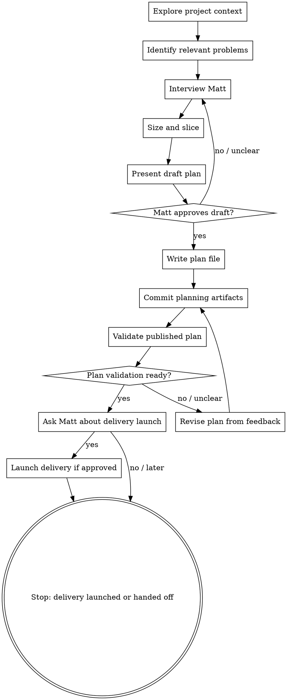

# Iteration Planning Interview

## Overview

Help Matt turn an early idea for the next iteration into an implementation-ready iteration plan. Interview him through natural collaborative dialogue, write the plan down, publish it, validate it, then ask Matt whether he wants the current LLM session to launch the Fabro delivery workflow that runs implementation and review.

<HARD-GATE>
Do NOT implement the iteration directly in the local checkout. Do NOT edit application code, migrations, step definitions, UI, or production docs except for iteration-planning artifacts in that iteration's `docs/iterations/` folder and acceptance feature files/scenarios when they are part of planning. Feature files are domain modelling and acceptance criteria; step definitions and executable test plumbing are implementation. This skill's terminal state is either committed, pushed, and plan-validated planning artifacts followed by Matt's explicit choice about launching `bin/dev fabro deliver <plan_path>`; a revised plan after validation feedback; or a clear explanation of why publishing, validation, or delivery launch was blocked.
</HARD-GATE>

## Runtime Compatibility

This skill is intended to work in both Pi and Claude Code. Claude Code is advised when the iteration needs new or changed design-system work.

- **Pi is fine** for technical/internal iterations and behaviour-facing iterations that can reference sufficient existing checked-in design sources.
- **Claude Code is advised** when the iteration adds or changes a screen, page, component, email, or visible state, because the design system lives at `claude.ai/design` and can be inspected with Claude Code's `DesignSync` tool.
- If you are not running in Claude Code and discover that new or changed design work is needed and no sufficient existing checked-in design source is available, stop before drafting, writing, committing, or validating the plan. Tell Matt the iteration should continue in Claude Code, summarize the context gathered so far, and give him a concise restart prompt. Do not skip or fake the design check.
- Only call `DesignSync` when running in Claude Code and the tool is available. In Pi or any other environment, treat `DesignSync` as unavailable and cite only checked-in design sources you actually inspected.

## Checklist

Create a task for each item and complete them in order:

1. **Explore project context** — read relevant project docs, current plans, ADRs, recent commits, code only as needed to understand the iteration, and `docs/problems/README.md` plus relevant `docs/problems/*.md` notes.
2. **Identify relevant problems** — decide which captured problems the iteration might resolve, partially address, depend on, or deliberately leave unresolved. Bring those problems into brainstorming and slicing rather than treating the iteration as a standalone idea.
3. **Interview Matt** — ask clarifying questions one at a time about goal, relevant problems, scope, acceptance criteria, business decisions, implementation shape, and validation.
4. **Size and slice** — decide whether the work is one shippable slice or several. If it is more than one, split it into separate iteration plans before going further (see Sizing and Slicing). Use the related problem notes to avoid bundling several unrelated problems into one iteration.
5. **Present draft plan sections and feature scenarios** — get Matt's approval or corrections before writing the final plan. Present the related problems and planned status changes alongside the draft plan. For every behaviour-facing iteration, present the BDD decision explicitly: either the acceptance feature files/scenarios to draft or update, or the reason Gherkin would not add useful stakeholder-readable examples for this slice. If acceptance feature files/scenarios are drafted or changed, explicitly invite Matt to review them as domain language before calling the plan done. Also present the **design decision** (see Design Check): for each user-facing surface, the existing design that covers it, or — if one is needed and missing — a reminder to create it. If new or changed design work is needed and the current session is not Claude Code with `DesignSync`, stop and hand off to Claude Code instead of presenting a draft.
6. **Write the iteration plan** — create an iteration folder at `docs/iterations/<iteration-number>-<topic>/` and save the plan as `plan.md` inside it. Add supporting planning artifacts there too, such as a manual demo/test script when useful. Include a `Related Problems` section, an `Iteration Type` section, an `Acceptance Scenarios / Feature Files` section, and a `Designs` section. Draft or update acceptance feature files/scenarios when they clarify the domain behaviour for the iteration; for behaviour-facing iterations, do not leave this section silent. If no Gherkin changes are useful, state the rationale. Tag every new or changed scenario (or the whole feature if all scenarios are new/changed for the iteration) with `@iteration-NNN` matching the iteration number; preserve existing iteration tags, because a scenario may evolve through multiple iterations. If feature changes are intentionally ahead of implementation and may fail today, mark the affected new/changed scenarios (or the whole feature) with `@wip` before publishing them. Maintain `docs/iterations/README.md` as an index.
7. **Publish planning artifacts** — before committing, verify the checkout is not left red by planning-only acceptance changes; run `dev check` when practical, or at least the targeted test/configuration checks that would discover the changed feature files. If a planning feature is expected to fail until implementation, confirm it is tagged `@wip` and excluded by the relevant test command/configuration. Then commit and push the plan, iteration index, supporting planning artifacts, acceptance feature files, and any skill changes needed for validation before running Fabro, so Fabro's clone-based remote sandbox can see them. Do not commit or push unrelated changes.
8. **Validate the published plan** — after the planning artifacts are committed and pushed, run:
   ```bash
   bin/dev fabro validate-plan <plan_path>
   ```
   Use the validation feedback to revise the plan when needed. If validation reports `NOT READY`, summarize the blocking gaps, ask Matt one question at a time to resolve them, edit the plan, commit and push the revision, and re-run validation. Do not call the plan ready until validation passes or validation is blocked/unavailable with the exact reason recorded.
9. **Ask whether to launch delivery** — do not launch delivery automatically. After validation passes, ask Matt whether he wants this LLM session to run the implementation-and-review delivery workflow now, or whether he wants to run it himself later. Use the `question` tool when available. Always show the exact command:
   ```bash
   bin/dev fabro deliver <plan_path>
   ```
   If Matt chooses to proceed, run that command. If he declines or does not answer, stop after reporting the command.

## Process Flow



## BDD Scenario Heuristics

Do not treat BDD as optional polish for behaviour-facing work. Make an explicit BDD decision during planning and write it into `## Acceptance Scenarios / Feature Files`.

Default to drafting or updating Gherkin when any of these are true:

- The iteration changes who can do what, when, or under which policy.
- The behaviour is visible to a customer, member, club operator, staff user, or support/operator persona.
- The plan contains business rules, permissions, lifecycle states, eligibility, routing, notification, pricing, privacy, or safety/trust implications.
- The examples would help Matt spot a misunderstanding before implementation.
- The behaviour needs edge-case examples to explain it clearly, such as unknown/expired/duplicate/unauthorised/error cases.
- Future agents or collaborators would benefit from stakeholder-readable executable documentation.

Use `bdd-discovery` before writing Gherkin when the rules, examples, vocabulary, questions, or slice boundaries are not yet obvious. Signals include multiple actors, several rules in one idea, policy exceptions, uncertainty about expected outcomes, or examples that reveal the iteration may need slicing.

Use `bdd-formulation` when drafting or reviewing Gherkin scenarios so feature files remain domain modelling artifacts rather than test scripts.

It is usually reasonable not to add Gherkin when the iteration is purely technical or operational and has no new user-observable rule: refactoring, dependency updates, internal performance work, logging/observability, CI/tooling, bug fixes where an existing scenario already states the intended behaviour, or implementation plumbing for a previously formulated scenario.

When deciding not to add or change feature files for a behaviour-facing iteration, write a short rationale in the plan. A good rationale names the existing scenario that already covers the rule, or explains why the behaviour is too internal/obvious for a useful stakeholder example. `Covered by ExUnit/controller tests` is not sufficient by itself for business-facing behaviour.

## Design Check

The design system (claude.ai/design) is the source of truth for design and is meant to mirror the running app (see `CLAUDE.md`). For any iteration with a user-facing surface, make an explicit design decision during planning — the way you make a BDD decision — and write it into `## Designs`.

Environment gate:

- If the iteration is purely internal or technical with no visible surface, no design-system access is needed; this skill may continue in Pi or Claude Code.
- If the iteration adds or changes a screen, page, component, email, or visible state, prefer running the planning session in Claude Code with `DesignSync` available. If it is not, use existing checked-in design sources when they are sufficient, record that `DesignSync` was not available in this session, and stop only when new or changed design work is needed and no sufficient existing checked-in design source is available.
- Do not call, mention output from, or pretend to have checked `DesignSync` outside Claude Code.

Decide three things:

1. **Does this iteration need a design?** Yes if it adds or changes a screen, page, component, email, or a visible state (empty / first-run / loading / error / success). No for purely internal or technical work (refactors, data/model changes, background jobs, infra, observability) with no visible surface — record `No design needed` and why.
2. **Do we already have it?** In Claude Code, check the design system with `DesignSync` (`list_files`, then `get_file`). In any environment, check existing checked-in design sources such as `design-system/` and `docs/specs/*` sketches for each affected surface. Reference what exists by path (e.g. a DS card `wireframes/*.html`, `ui_kits/*/index.html`, `emails/*.html`, or a sketch section). A design that is close but missing the new elements still counts as the base to extend — say so.
3. **If it's needed and missing, remind to create it.** Do not leave a user-facing surface with no referenced design and no reminder. The reminder is: mock the surface as a self-contained design-system preview, render-verify it (headless render), and push it to the DS via `DesignSync` in Claude Code — done before implementation where possible. If the iteration is already building, record it as a **fast-follow** design to align the in-flight build/review to.

Write the outcome in `## Designs`: for each affected surface, the design that covers it (with path) or the reminder to create one. When a feature spans several iterations, design the **final** version once and note which elements earlier slices omit, rather than a separate design per slice. Default to "needs a design" whenever the iteration changes anything a user sees; `No design needed` is for genuinely invisible technical work.

## Interview Guidance

Ask only one question per message. Prefer multiple choice when it lowers effort, but use open questions when needed. When asking a multiple-choice question, use the `question` tool rather than writing A/B/C/D options in prose. Use normal chat only for open-ended questions or when the tool cannot express the choice clearly.

Before or during early brainstorming, inspect `docs/problems/README.md` and relevant `docs/problems/*.md` files. Use them to ask whether the iteration should resolve, partially address, or deliberately defer any captured problems. If Matt's idea resembles an unresolved or partially addressed problem, name that problem explicitly and ask how tightly the iteration should target it.

Cover these topics:

- **Goal** — what should be true after the iteration that is not true now?
- **Related problems** — which `docs/problems` notes does this iteration address, partially address, depend on, or leave unresolved?
- **Beneficiary** — who benefits: club admin, member, developer/operator, or another actor?
- **Smallest useful slice** — is this one rule or one piece of engineering, or several? (see Sizing and Slicing)
- **Scope boundaries** — what is explicitly out of scope?
- **Acceptance criteria** — concrete behaviours, examples, edge cases, permissions, and error states.
- **Business decisions** — domain, policy, copy, workflow, pricing, privacy, or support questions.
- **Technical shape** — likely modules, data, events/commands, integrations, UI, background work, and migration concerns.
- **Design** — does this iteration touch a screen, page, component, email, or visible state? If so, prefer Claude Code and `DesignSync`; when this session is not Claude Code, check existing checked-in design sources and stop only if new or changed design work is needed without a sufficient existing design source. Also check whether there is an existing sketch. (see Design Check)
- **Validation** — automated tests, acceptance tests, shared Cucumber scenarios, manual demo, stakeholder review, or operational checks.

Stop interviewing when you can write a plan that an engineer could start without inventing material product or technical decisions.

## Sizing and Slicing

An iteration should be **one shippable slice**: either one behaviour rule, or
one piece of engineering. Before drafting the plan, check the size and split
if needed.

- **Classify the work.** Is it behaviour-facing (changes what a user can
  observe) or technical/engineering (enables or restructures, with no new
  user-observable behaviour)?
- **Find the seams.** For behaviour-facing work, each Rule from example
  mapping is normally its own shippable slice, with that rule's examples as
  the slice's acceptance scenarios. For technical work, slice by capability.
- **Foundation first.** When behaviour needs architecture that does not exist
  yet (e.g. an event store before the first message can be sent), make that
  enabling architecture its own earlier technical iteration.
- **Split when it is more than one slice.** If the work spans several rules or
  bundles new architecture with behaviour, write it as several iteration
  plans, each independently shippable, rather than one big plan. A good slice
  leaves the build green with strictly more scenarios passing — or, for a
  technical slice, the same scenarios but a proven capability.

If you split a plan, replace it with the child plans (no parent/epic doc) and
number them sequentially before any of them is implemented.

Worked example: the original "member message deliverability" plan bundled the
whole event-sourced stack, two contexts, and all delivery statuses into 18
tasks, and repeatedly failed to implement. It was split into four shippable
iterations — `001` event-sourced foundation (technical), then `002`
membership, `003` messaging, `004` statuses and views (one rule each). See
`docs/iterations/`.

## Plan Format

Write the plan as Markdown with these sections:

```markdown
# <Iteration title>

Date: YYYY-MM-DD
Status: draft | ready | needs-revision

## Goal

## Background / Context

## Related Problems

List relevant `docs/problems` notes. For each one, state whether this iteration is expected to resolve it, partially address it, depend on it, or leave it unresolved. If none are relevant, write `None known.`

## Scope

### In scope

### Out of scope

## Iteration Type

Behaviour-facing or technical/engineering. For behaviour-facing iterations, identify the user-observable rule or policy changed. For technical iterations, state why there is no new user-observable behaviour.

## Acceptance Scenarios / Feature Files

State the BDD decision: `Required`, `Useful but not required`, or `Not useful for this slice`. For behaviour-facing iterations, name the shared Cucumber feature file(s) and scenarios that will express the business rules, or state why Gherkin would not add useful stakeholder-readable examples for this slice. For technical iterations, write `Not applicable` and the reason. If implementation is allowed to edit `.feature` files, also include a separate `## Allowed acceptance feature changes` section naming each exact file, the allowed kind of change, the reason, and how coverage is preserved or intentionally changed.

## Designs

Apply the Design Check. For each user-facing surface the iteration adds or changes, name the design that covers it (a design-system card or a `docs/specs` sketch, by path), or note that no design exists yet and must be created in Claude Code (a reminder to mock + render-verify + push to the DS there; mark it a fast-follow if the iteration is already building). Write `No design needed` with a reason for purely internal/technical iterations.

## Acceptance Criteria

## Open Business Decisions

## Implementation Plan

## Open Technical Decisions

## New Capability

What we expect to be able to do once this is done that we could not do before.

## Validation Plan

How we will validate that we have been successful.

## Risks / Follow-ups
```

Keep plans focused. If a section has no open decisions, write `None known.` rather than omitting it.

## Writing the Plan

- Create `docs/iterations/` if it does not exist.
- Maintain `docs/iterations/README.md` as the iteration index.
- Read `docs/problems/README.md` if it exists, plus any relevant `docs/problems/*.md` notes. If the directory exists but no README exists, inspect the problem files directly.
- Include a `## Related Problems` section in the plan. Link each relevant problem note and say whether the iteration should resolve it, partially address it, depend on it, or intentionally leave it unresolved. If there are no relevant captured problems, write `None known.`
- Create one folder per iteration using the next sequential zero-padded iteration number and a lowercase hyphenated topic slug.
- Determine the next number by inspecting existing `docs/iterations/NNN-*` folders; start at `001` if none exist.
- Save the plan as `plan.md` inside that folder.
- Put supporting planning artifacts for the same iteration in the same folder, such as `manual-demo-script.md` or `validation-notes.md`.
- Classify the iteration in the plan as behaviour-facing or technical/engineering. For behaviour-facing iterations, fill in `## Acceptance Scenarios / Feature Files` with a BDD decision of `Required`, `Useful but not required`, or `Not useful for this slice`, plus either the feature file(s)/scenario summaries that express the business rules or an explicit rationale for why Gherkin would not add useful stakeholder-readable examples. Do not rely on low-level ExUnit/controller tests as a substitute for this BDD decision.
- Apply the BDD scenario heuristics above before deciding. If two or more “default to Gherkin” signals apply, draft scenarios unless Matt explicitly decides otherwise.
- Draft or update shared Cucumber feature files/scenarios when they clarify the iteration's domain behaviour. Use `bdd-discovery` first if the rules/examples are unclear, and `bdd-formulation` when writing or reviewing the Gherkin. Keep scenarios abstract from test infrastructure: no CSS selectors, route names, button-click choreography, database setup, or adapter configuration.
- Include a `## Designs` section and apply the Design Check: for each user-facing surface, reference an existing design (a design-system card or a sketch, by path — check the DS with `DesignSync` only in Claude Code, otherwise cite checked-in design sources you inspected) or record a reminder to create one (mock + render-verify + push to the DS in Claude Code, or a fast-follow if already building). If new or changed design work is needed and no sufficient existing checked-in design source is available, stop and hand off instead of continuing. Write `No design needed` with a reason for internal/technical iterations. Design the final version once for multi-iteration features and note what earlier slices omit. Do not author the design during ordinary planning unless Matt asks — the planning deliverable is the decision and the reminder, not the mock.
- Tag every scenario created or changed during planning with the iteration tag `@iteration-NNN`, where `NNN` is the zero-padded iteration number. If every scenario in a new or changed feature belongs to that iteration, a feature-level `@iteration-NNN` tag is acceptable. Do not remove older iteration tags from existing scenarios; multiple iteration tags are allowed and useful when a scenario evolves across iterations.
- Preserve a green mainline while planning. Existing executable scenarios should keep passing. If planning deliberately rewrites or adds scenarios that describe future behaviour and would fail before implementation catches up, tag each affected scenario with `@wip`; if every scenario in a changed feature is future-facing, a feature-level `@wip` is acceptable. Prefer scenario-level tags when only part of a feature is unfinished. Do not leave untagged future-facing scenarios that make `dev check` fail.
- When feature files/scenarios are created or changed, show Matt the feature file path, which scenarios are tagged with `@iteration-NNN`, which scenarios are `@wip`, and a concise summary of the scenarios, and explicitly ask him to review the language/examples before treating the plan as final.
- Before publishing, run `dev check` when practical. If it is too slow, run the targeted checks that discover/execute the changed acceptance feature files. If the check fails because a future-facing scenario is unimplemented, add or narrow `@wip` tags rather than editing step definitions or app code. If the project does not currently exclude `@wip`, stop and report that the planning change would make the build red instead of committing it.
- Do not implement step definitions, fixtures, app code, migrations, UI, or test adapters during planning.
- Add or update the index entry in `docs/iterations/README.md` with the iteration number, title/topic, plan link, date, status, and any acceptance feature files changed.
- Do not update Fabro workflow code or problem-note status files during ordinary iteration planning. The relevant problems belong in the plan's `## Related Problems` section. Only edit `docs/problems/*.md` or `docs/problems/README.md` if Matt explicitly asks for problem-note maintenance as part of the planning task.
- Example: `docs/iterations/001-member-import/plan.md`.
- Commit and push the plan, iteration index, supporting planning artifacts, and acceptance feature files before running Fabro validation so the clone-based remote sandbox can see them. Do this only after the acceptance files are either still executable and green, or explicitly marked `@wip` and excluded from the planning-time checks. Then run `bin/dev fabro validate-plan <plan_path>` and use the feedback to revise the plan before asking Matt about delivery.
- Include workflow/skill changes in that commit only when they are needed for planning or validation.
- Do not commit or push unrelated changes or implementation work.

## Validating and Optionally Launching Fabro Delivery

After committing and pushing the planning artifacts, run plan validation before asking about delivery:

```bash
bin/dev fabro validate-plan docs/iterations/NNN-topic/plan.md
```

The workflow runs in clone-based remote sandboxes; pushed artifacts are required so Fabro can read newly-created plans and acceptance feature files. Do not ask Matt whether to launch delivery until validation has passed. If validation is unavailable, report the blocker and the retry command instead of asking to launch delivery.

If validation reports NOT READY:

1. Summarize the blocking gaps.
2. Ask Matt one question at a time to resolve them.
3. Edit, commit, and push the plan.
4. Re-run `bin/dev fabro validate-plan <plan_path>`.
5. Repeat until validation reports ready or validation is blocked by an unavailable local Fabro service or another explicit external blocker.

After validation passes, do not wrap delivery in another skill or workflow. Ask Matt whether he wants this LLM session to run the user-controlled delivery command now. Use the `question` tool when available with choices equivalent to:

- Yes — run implementation and review now.
- No — stop after handing off the command.

Always show the exact command:

```bash
bin/dev fabro deliver docs/iterations/NNN-topic/plan.md
```

This command reserves the implementation WIP slot, runs implementation, and runs review from the CLI with `--auto-approve` at the user-approved boundary. If Matt says yes, run the command and report the initial result. If Matt says no or does not explicitly approve, do not run it.

If the local Fabro server is unavailable or the command fails before creating a run:

1. Report the exact error.
2. Do not treat the plan as validated.
3. Tell Matt the plan file path and the exact command to retry.

When planning is complete, report:

1. Plan path.
2. Commit SHA pushed.
3. Plan validation command and result.
4. Related problems named in the plan, including any that remain unresolved or partially addressed.
5. Any acceptance feature files changed, their `@iteration-NNN` tags, and whether they are `@wip`.
6. Matt's delivery-launch choice.
7. Exact delivery command: `bin/dev fabro deliver <plan_path>`.

## Key Principles

- One question at a time.
- One iteration is one slice: one rule, or one piece of engineering. Split anything bigger.
- Make business decisions explicit.
- Make technical decisions explicit enough to start.
- Make acceptance criteria testable.
- Make validation observable.
- If a user sees it, it needs a design: check the design system for an existing one, and if it is missing, record a reminder to create it (fast-follow if already building).
- Do not implement locally during this skill; `bin/dev fabro deliver` owns implementation after Matt explicitly approves launching it or runs it himself.
