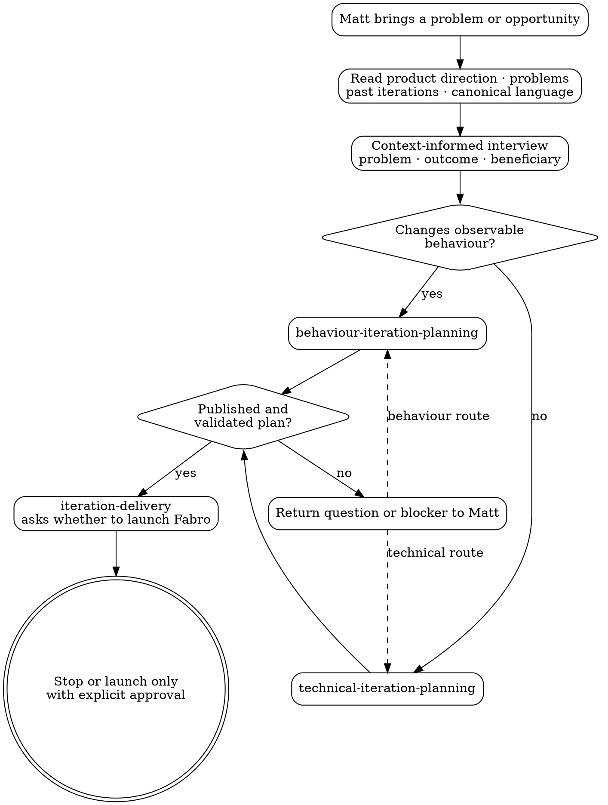

# Iteration Planning Router

Use this skill as the single entry point for iteration planning. Keep this layer thin: understand the product context, establish what Matt wants to change, classify the work, invoke the specialist skill, then hand a validated plan to `iteration-delivery`.

Before interviewing, make a short, read-only context pass so questions are informed rather than generic. Read the current product direction in `docs/iterations/roadmap.md`, the iteration history in `docs/iterations/README.md`, the canonical language in `docs/problem-domain-terms.md`, and `docs/problems/README.md` plus current problem records relevant to Matt's opening request. Inspect relevant recent or related iteration plans and acceptance features when they clarify what has already been tried or agreed. Summarize the likely context and uncertainties internally; do not infer Matt's present intent from repository history.

Do not write the plan, formulate scenarios, model the domain, author ADRs, validate the plan, or launch Fabro in this router; those responsibilities belong to lower-level skills. Keep this context pass targeted: broad implementation exploration belongs to the selected specialist.

## Intake

With that context, ask Matt one focused question at a time until you know:

- the problem or opportunity;
- the intended outcome;
- who or what benefits;
- whether success changes observable product/domain behaviour.

This is a short routing interview, not detailed discovery.

## Classification

Choose exactly one route:

- **Behaviour-changing** — changes what a customer, member, staff user, operator, integration, or other domain actor can observe; changes a business rule, policy, permission, lifecycle outcome, notification meaning, or externally visible result. Invoke `behaviour-iteration-planning`.
- **Technical/refactoring** — preserves agreed observable behaviour while changing internal structure, tooling, dependencies, performance, operability, migration machinery, or engineering capability. Invoke `technical-iteration-planning`.

If classification is unclear, ask Matt. Do not inspect implementation and infer the product classification silently. If a proposed technical iteration changes business behaviour, route it as behaviour-changing.

Pass the specialist the context summary, intake summary, relevant source links, and Matt's wording. The specialist initializes `planning-progress` with its complete flow, then performs deeper targeted context exploration.

## Completion

The selected specialist returns either:

- a published, validated plan path and commit;
- a question or decision for Matt; or
- a precise planning/validation blocker.

For a validated plan, invoke `iteration-delivery`. That skill owns the explicit launch decision and any Fabro command. Planning does not imply launch approval.

## Process Flow

