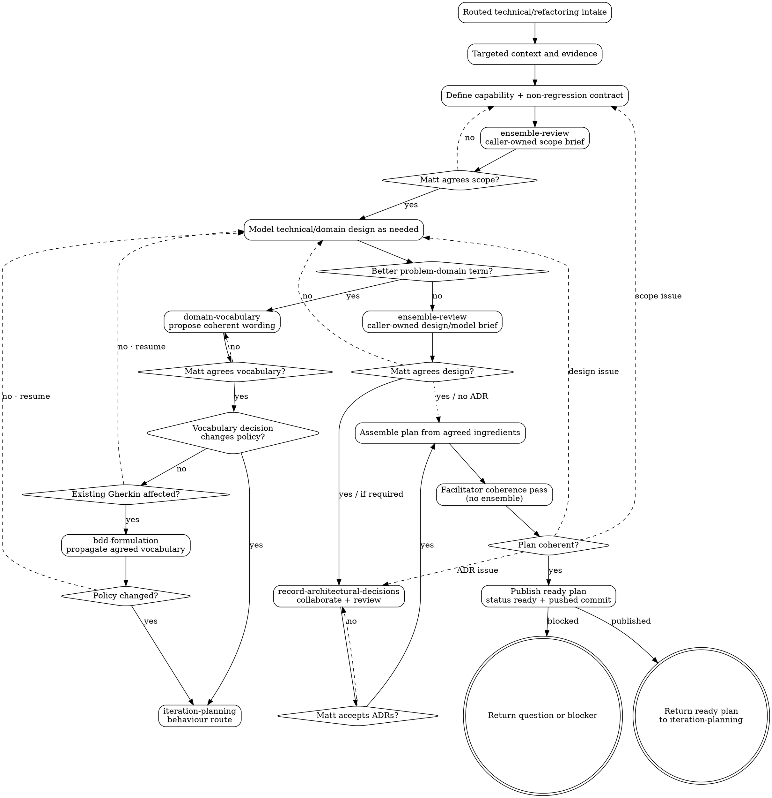

# Technical / Refactoring Iteration Planning

Starting from the intake supplied by `iteration-planning`, produce a focused, published ready engineering plan without importing the behaviour-planning ceremony.

<HARD-GATE>
Do not implement the iteration or launch delivery. Do not edit application code, step definitions, low-level tests, migrations, dependencies or workflow machinery while planning. Planning may edit iteration artifacts, `docs/problem-domain-terms.md` and acceptance Gherkin wording only for vocabulary changes Matt explicitly agrees, and ADRs plus `docs/adr/README.md` only when Matt explicitly accepts the decisions. Vocabulary edits must preserve agreed behaviour; a policy change requires behaviour planning. Return the ready plan to `iteration-planning`, or an optionally validated plan when Matt explicitly chooses validation-only; `iteration-delivery` owns Fabro validation-and-launch.
</HARD-GATE>

## Flow

1. **Explore targeted context** — after routing has identified the engineering problem, inspect relevant code, tests, tooling, ADRs, problems and operational evidence.
2. **Clarify the capability** — with Matt, define the current limitation, desired engineering capability, behaviour that must remain unchanged, beneficiaries, constraints and observable proof.
3. **Slice and defer** — map technical prerequisites, risks, questions and independently useful capabilities. Keep one engineering capability per iteration; defer adjacent cleanup.
4. **Review and agree scope** — run `ensemble-review` with the Technical-scope brief below. Present simpler approaches, hidden behaviour changes, missing evidence and deferrals to Matt. Revise until he agrees the capability and boundaries.
5. **Model architecture and maintain vocabulary where needed** — if the work changes domain concepts, commands, events, invariants or ownership, use `domain-modelling`, `domain-vocabulary`, and the canonical lexicon; otherwise document affected solution-domain responsibilities, interfaces, data flow and operational boundaries directly. Do not invent product behaviour or put solution terms into the problem-domain lexicon. When modelling reveals better problem-domain language, ask Matt through `domain-vocabulary`. After he agrees the term, update the lexicon, model, and affected Gherkin with `bdd-formulation` only where the changed concept is used, preserving every rule, example, timing, actor, and outcome. Check the resulting diff for semantic coherence; do not add another ensemble or approval ceremony merely to propagate Matt's agreed vocabulary. If applying the term exposes a product-policy change rather than wording, return to `iteration-planning` for behaviour planning.
6. **Review and agree architecture** — run `ensemble-review` with the Domain-model or Technical-design brief below. Resolve findings with Matt and repeat any affected review checkpoint.
7. **Resolve architecture decisions** — use `record-architectural-decisions` for consequential choices emerging from the agreed model/design. That shared skill owns ADR collaboration, its caller-supplied ensemble brief, publication, and Matt's explicit acceptance.
8. **Assemble the plan** — compose the agreed capability, non-regression contract, technical/domain design, vocabulary decisions, ADRs, implementation boundaries and validation approach without introducing new decisions.
9. **Facilitator coherence pass** — as the planning facilitator, check the assembled plan against the agreed ingredients, implementation boundary, non-regression contract, validation approach, and status/index metadata. Do not run a duplicate assembled-plan ensemble. Return substantive findings to the owning step and repeat its existing review/Matt-agreement checkpoint.
10. **Publish the ready plan** — update the iteration index with status `ready`, run appropriate planning checks, then commit and push. If Matt explicitly chooses validation-only before launch, run `bin/dev fabro validate-plan <plan_path>` after publication and route substantive findings back through their owning step.
11. **Return the result** — give `iteration-planning` the ready plan path and pushed commit, or the validated result when validation-only was explicitly chosen, or the exact question/blocker. Do not launch delivery.

## Caller-Owned Ensemble Briefs

Every brief below also includes:

- **Known questions:** the artifact's current questions, or `None`.
- **Constraints:** the agreed capability and behaviour-preservation contract, boundaries and non-goals; read-only review; no product-policy, architecture, vocabulary or acceptance decisions; Matt is decision owner.

Use the named feedback route in each brief.

### Technical-scope brief

- **Subject/artifact:** capability map, evidence, constraints, proof, risks and deferrals.
- **Focus:** (1) simpler/smaller capability, (2) hidden behaviour change and failure risk, (3) evidence and proof coherence.
- **Rubric:** Is this one useful engineering capability? Can prerequisites or cleanup be removed or deferred? Does any proposal actually change observable behaviour? Are constraints and proof concrete enough to distinguish success?
- **Feedback route:** technical capability shaping and Matt; hidden product changes return to `iteration-planning` for reclassification.

### Domain-model brief

- **Subject/artifact:** agreed technical capability and non-regression contract, canonical vocabulary, and draft domain model.
- **Focus:** (1) simplicity, (2) invariants/lifecycle/temporal risk, (3) language, ownership and traceability.
- **Rubric:** Does the model enable only the agreed capability while preserving behaviour? Are commands, events, invariants, ownership and compatibility coherent? Are canonical problem-domain terms reused and solution terms clearly separated? Which choices need Matt and perhaps an ADR?
- **Feedback route:** `domain-modelling`; problem-language findings to `domain-vocabulary`; behaviour changes to the router; decisions to Matt.

### Technical-design brief

- **Subject/artifact:** agreed capability/non-regression contract and draft responsibilities, interfaces, data flow, migration and operational design.
- **Focus:** (1) accidental complexity, (2) compatibility/failure/rollback risk, (3) responsibility, operability and proof coherence.
- **Rubric:** Is the design sufficient without broadening scope or changing behaviour? Are lifecycle, interfaces, data movement, migration, rollback, observability and operational ownership clear? Which consequential choices need Matt and perhaps an ADR?
- **Feedback route:** technical design collaboration and Matt; product or domain discoveries return upstream.


## Process Flow



## Writing the Plan

Inspect existing `docs/iterations/NNN-*` folders and use the next sequential zero-padded number, starting at `001`. Create `docs/iterations/NNN-lowercase-topic/plan.md`; keep supporting planning artifacts in the same folder. Do not edit implementation, test, migration, dependency or workflow files, except for the Matt-approved vocabulary-only acceptance Gherkin edits defined above.

Use these exact sections unless an existing ready/validated template requires additional metadata:

- **Title / Status** — iteration number and topic; status `ready` when published.
- **Context** — evidence for the current engineering limitation and why it matters now.
- **Goal / New Capability** — the engineering outcome, not a list of tasks.
- **Iteration Type** — `Technical/engineering`, with why no new observable behaviour is intended.
- **Behaviour Preservation Contract** — observable behaviour, public interfaces and existing acceptance scenarios that must remain unchanged.
- **Scope** — one technical capability and its implementation boundary.
- **Out of Scope** — explicit deferrals, especially adjacent cleanup and product changes.
- **Related Problems** — inspect `docs/problems/README.md` and relevant notes; link each and state whether the iteration resolves, partially addresses, depends on or leaves it unresolved. Write `None known.` when appropriate; do not change problem-note status unless Matt asks.
- **Acceptance Scenarios / Feature Files** — normally `Not applicable`, with a reason and links to existing scenarios that protect unchanged behaviour where useful. When Matt-approved vocabulary changes require wording-only Gherkin edits, name every affected file/scenario and state that rules, examples, timing, actors, and outcomes are preserved. A needed new or behaviour-changing scenario means returning to the router for behaviour planning.
- **Designs** — `No design needed` with a reason. If the work changes a visible surface, return to the router to reconsider classification.
- **Technical Model** — responsibilities, interfaces, data flow, lifecycle, compatibility, migration, rollback and operational boundaries. Use `## Domain Model` instead when domain concepts, commands, events, invariants or ownership change.
- **Domain Vocabulary** — when domain concepts change, list canonical terms reused, Matt-agreed lexicon changes, separately labelled solution terms, and unresolved naming questions; otherwise `No problem-domain vocabulary change`.
- **Architecture Decisions** — links to every required Matt-accepted ADR produced through `record-architectural-decisions`, or `None required` with a reason. Do not defer a consequential choice to implementation.
- **Implementation Plan** — ordered, bounded steps, naming likely areas without prescribing speculative machinery.
- **Validation Plan** — focused proof of the capability, non-regression evidence, migration/rollback and operational checks where relevant, and `dev check` as the final project gate for implementation.
- **Risks / Follow-ups** — concrete failure modes, mitigations and deferred work.

The plan must be specific enough to implement without inventing product policy or consequential architecture. Do not include story points or time estimates unless Matt asks.

## Publishing and Optional Validation

1. Maintain `docs/iterations/README.md` with number, title, plan link, date and status `ready`.
2. Create or update ADRs only after Matt's explicit acceptance, and maintain `docs/adr/README.md`.
3. Review the changed planning artifacts for coherence and run `git diff --check`. Run `dev check` whenever acceptance Gherkin changed, even for vocabulary-only edits; for docs/skill-only planning edits, do not run it unless executable examples or scripts also changed.
4. Commit only agreed planning artifacts, including any Matt-agreed `docs/problem-domain-terms.md` change and accepted ADRs; do not include unrelated or implementation work.
5. Push the commit so Fabro can see the exact published ready plan state.
6. Return the ready plan path, pushed commit, related problems, accepted ADRs and any unresolved blocker to `iteration-planning`. Do not ask about or launch delivery here.

### Optional Validation-Only

If Matt explicitly wants validation without implementation, run after publication:

```bash
bin/dev fabro validate-plan docs/iterations/NNN-topic/plan.md
```

If validation finds a substantive issue, preserve the Fabro feedback and return it to scope, technical design/domain modelling, or ADR collaboration as appropriate; repeat that step's existing ensemble and Matt-agreement checkpoint, republish, and rerun validation only if Matt still wants validation-only. Validation may not introduce product behaviour or silently broaden the technical capability. Return the validation result to `iteration-planning`; do not ask about or launch delivery here.

## Principles

- Preserve behaviour unless Matt reclassifies the work as behaviour-changing.
- One iteration is one engineering capability.
- Evidence and constraints precede implementation design.
- Prefer explicit deferral over opportunistic cleanup.
- Matt agrees consequential technical design and accepts ADRs; reviewers advise.
- The facilitator coherence pass is not a duplicate assembled-plan ensemble; the assembled plan needs no separate approval ceremony.
- Do not implement or launch delivery in this skill; return the published ready plan, or an explicitly validation-only result, to `iteration-planning`.
