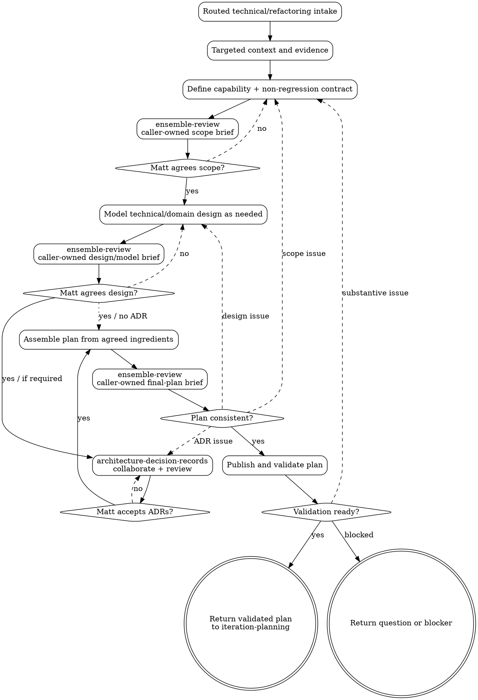

# Technical / Refactoring Iteration Planning

Starting from the intake supplied by `iteration-planning`, produce a focused, published and validated engineering plan without importing the behaviour-planning ceremony.

<HARD-GATE>
Do not implement the iteration or launch delivery. Do not edit application code, tests, migrations, dependencies or workflow machinery while planning. Planning may edit iteration artifacts, `docs/problem-domain-terms.md` only for vocabulary changes Matt explicitly agrees, and ADRs plus `docs/adr/README.md` only when Matt explicitly accepts the decisions. Return the validated plan to `iteration-planning`; `iteration-delivery` owns Fabro launch.
</HARD-GATE>

## Flow

1. **Explore targeted context** — after routing has identified the engineering problem, inspect relevant code, tests, tooling, ADRs, problems and operational evidence.
2. **Clarify the capability** — with Matt, define the current limitation, desired engineering capability, behaviour that must remain unchanged, beneficiaries, constraints and observable proof.
3. **Slice and defer** — map technical prerequisites, risks, questions and independently useful capabilities. Keep one engineering capability per iteration; defer adjacent cleanup.
4. **Review and agree scope** — run `ensemble-review` with the Technical-scope brief below. Present simpler approaches, hidden behaviour changes, missing evidence and deferrals to Matt. Revise until he agrees the capability and boundaries.
5. **Model architecture only where needed** — if the work changes domain concepts, commands, events, invariants or ownership, use `domain-modelling`, `domain-vocabulary`, and the canonical lexicon; otherwise document affected solution-domain responsibilities, interfaces, data flow and operational boundaries directly. Do not invent product behaviour or put solution terms into the problem-domain lexicon.
6. **Review and agree architecture** — run `ensemble-review` with the Domain-model or Technical-design brief below. Resolve findings with Matt; route any problem-domain naming issue through `domain-vocabulary` and, when behaviour wording changes, back to behaviour planning.
7. **Resolve architecture decisions** — use `architecture-decision-records` for consequential choices emerging from the agreed model/design. That shared skill owns ADR collaboration, its caller-supplied ensemble brief, publication, and Matt's explicit acceptance.
8. **Assemble the plan** — compose the agreed capability, non-regression contract, technical/domain design, vocabulary decisions, ADRs, implementation boundaries and validation without introducing new decisions.
9. **Check consistency** — run `ensemble-review` with the Technical final-plan brief below. Return substantive findings to the owning step and repeat its review/Matt-agreement checkpoint.
10. **Publish and validate** — update the iteration index, run appropriate planning checks, commit and push, then run `bin/dev fabro validate-plan <plan_path>`. Route substantive findings back through the owning step.
11. **Return the result** — give `iteration-planning` the validated plan path and commit, or the exact question/blocker. Do not launch delivery.

## Caller-Owned Ensemble Briefs

Every brief below also includes:

- **Known questions:** the artifact's current questions, or `None`.
- **Constraints:** the agreed capability and behaviour-preservation contract, boundaries and non-goals; read-only review; no product-policy, architecture, vocabulary or acceptance decisions; Matt is decision owner.

Use the named feedback route in each brief.

### Technical-scope brief

- **Subject/artifact:** capability map, evidence, constraints, proof, risks and deferrals.
- **Focus:** (1) simpler/smaller capability, (2) hidden behaviour change and failure risk, (3) evidence and proof coherence.
- **Rubric:** Is this one useful engineering capability? Can prerequisites or cleanup be removed or deferred? Does any proposal actually change observable behaviour? Are constraints and proof concrete enough to distinguish success?
- **Feedback route:** technical capability shaping and Matt; hidden product changes return to `iteration-planning` for reclassification.

### Domain-model brief

- **Subject/artifact:** agreed technical capability and non-regression contract, canonical vocabulary, and draft domain model.
- **Focus:** (1) simplicity, (2) invariants/lifecycle/temporal risk, (3) language, ownership and traceability.
- **Rubric:** Does the model enable only the agreed capability while preserving behaviour? Are commands, events, invariants, ownership and compatibility coherent? Are canonical problem-domain terms reused and solution terms clearly separated? Which choices need Matt and perhaps an ADR?
- **Feedback route:** `domain-modelling`; problem-language findings to `domain-vocabulary`; behaviour changes to the router; decisions to Matt.

### Technical-design brief

- **Subject/artifact:** agreed capability/non-regression contract and draft responsibilities, interfaces, data flow, migration and operational design.
- **Focus:** (1) accidental complexity, (2) compatibility/failure/rollback risk, (3) responsibility, operability and proof coherence.
- **Rubric:** Is the design sufficient without broadening scope or changing behaviour? Are lifecycle, interfaces, data movement, migration, rollback, observability and operational ownership clear? Which consequential choices need Matt and perhaps an ADR?
- **Feedback route:** technical design collaboration and Matt; product or domain discoveries return upstream.

### Technical final-plan brief

- **Subject/artifact:** all agreed technical-planning ingredients and assembled plan.
- **Focus:** (1) scope/implementation boundary consistency, (2) non-regression/migration/operational proof, (3) end-to-end traceability.
- **Rubric:** Does the plan compose the agreed capability, behaviour-preservation contract, model/design, accepted ADRs, implementation boundary and validation without contradiction or a new decision? Can implementation proceed without inventing product policy or consequential architecture?
- **Feedback route:** the specialist owning each affected ingredient; repeat its ensemble and Matt checkpoint.

## Process Flow



## Writing the Plan

Inspect existing `docs/iterations/NNN-*` folders and use the next sequential zero-padded number, starting at `001`. Create `docs/iterations/NNN-lowercase-topic/plan.md`; keep supporting planning artifacts in the same folder. Do not edit implementation, test, migration, dependency or workflow files.

Use these exact sections unless an existing validated template requires additional metadata:

- **Title / Status** — iteration number and topic; status `Planned`.
- **Context** — evidence for the current engineering limitation and why it matters now.
- **Goal / New Capability** — the engineering outcome, not a list of tasks.
- **Iteration Type** — `Technical/engineering`, with why no new observable behaviour is intended.
- **Behaviour Preservation Contract** — observable behaviour, public interfaces and existing acceptance scenarios that must remain unchanged.
- **Scope** — one technical capability and its implementation boundary.
- **Out of Scope** — explicit deferrals, especially adjacent cleanup and product changes.
- **Related Problems** — inspect `docs/problems/README.md` and relevant notes; link each and state whether the iteration resolves, partially addresses, depends on or leaves it unresolved. Write `None known.` when appropriate; do not change problem-note status unless Matt asks.
- **Acceptance Scenarios / Feature Files** — normally `Not applicable`, with a reason and links to existing scenarios that protect unchanged behaviour where useful. A needed new product scenario means returning to the router for behaviour planning.
- **Designs** — `No design needed` with a reason. If the work changes a visible surface, return to the router to reconsider classification.
- **Technical Model** — responsibilities, interfaces, data flow, lifecycle, compatibility, migration, rollback and operational boundaries. Use `## Domain Model` instead when domain concepts, commands, events, invariants or ownership change.
- **Domain Vocabulary** — when domain concepts change, list canonical terms reused, Matt-agreed lexicon changes, separately labelled solution terms, and unresolved naming questions; otherwise `No problem-domain vocabulary change`.
- **Architecture Decisions** — links to every required Matt-accepted ADR produced through `architecture-decision-records`, or `None required` with a reason. Do not defer a consequential choice to implementation.
- **Implementation Plan** — ordered, bounded steps, naming likely areas without prescribing speculative machinery.
- **Validation Plan** — focused proof of the capability, non-regression evidence, migration/rollback and operational checks where relevant, and `dev check` as the final project gate for implementation.
- **Risks / Follow-ups** — concrete failure modes, mitigations and deferred work.

The plan must be specific enough to implement without inventing product policy or consequential architecture. Do not include story points or time estimates unless Matt asks.

## Publishing and Validation

1. Maintain `docs/iterations/README.md` with number, title, plan link, date and `Planned` status.
2. Create or update ADRs only after Matt's explicit acceptance, and maintain `docs/adr/README.md`.
3. Run structural checks appropriate to the changed planning artifacts, including `git diff --check`. These are docs/skill-only planning edits, so do not run `dev check` unless executable examples or scripts were also changed.
4. Commit only agreed planning artifacts, including any Matt-agreed `docs/problem-domain-terms.md` change and accepted ADRs; do not include unrelated or implementation work.
5. Push the commit so clone-based validation sees the exact plan state.
6. Run:

   ```bash
   bin/dev fabro validate-plan docs/iterations/NNN-topic/plan.md
   ```

7. If validation finds a substantive issue, return it to scope, technical design/domain modelling, or ADR collaboration as appropriate; repeat that step's ensemble and Matt-agreement checkpoint, republish, and rerun validation. Validation may not introduce product behaviour or silently broaden the technical capability.
8. Return the plan path, pushed commit, validation result, related problems, accepted ADRs and any unresolved blocker to `iteration-planning`. Do not ask about or launch delivery here.

## Principles

- Preserve behaviour unless Matt reclassifies the work as behaviour-changing.
- One iteration is one engineering capability.
- Evidence and constraints precede implementation design.
- Prefer explicit deferral over opportunistic cleanup.
- Matt agrees consequential technical design and accepts ADRs; reviewers advise.
- The assembled plan needs no separate approval ceremony.
- Do not implement or launch delivery in this skill.
